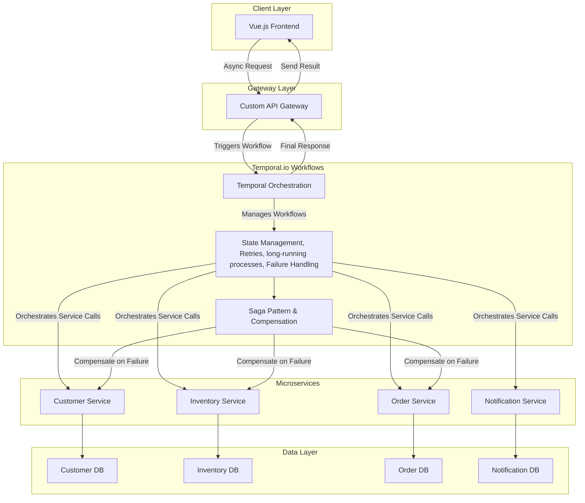
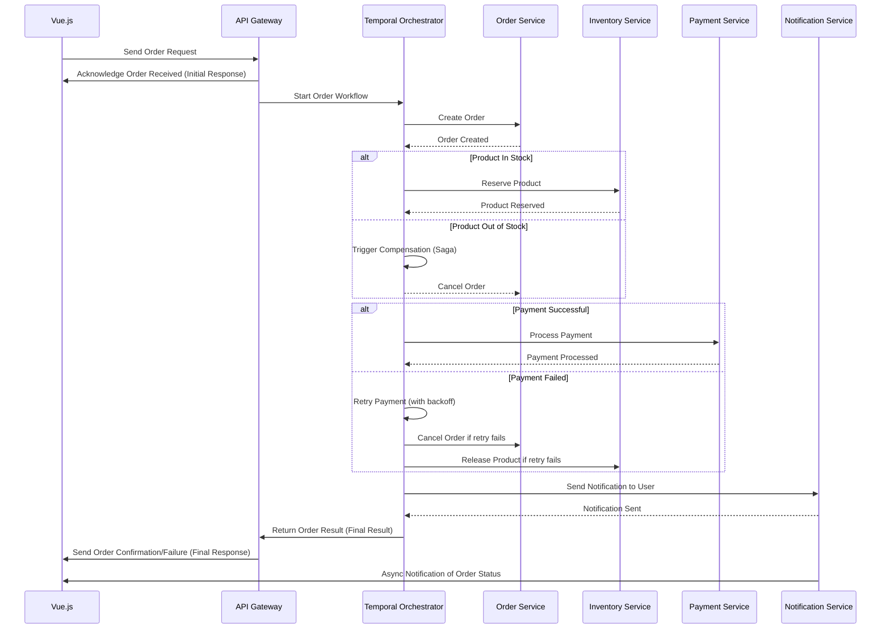

# Reference Architecture Overview

This document outlines a microservices-based reference architecture designed to handle distributed transactions, asynchronous processing, and workflow orchestration using Temporal.io. The architecture incorporates key components like a Vue.js frontend, an API Gateway, and dedicated microservices with independent databases. It leverages patterns such as the Saga pattern for distributed transaction management, retries with exponential backoff, and long-running async workflows.

## Architecture Components

### 1. Client Layer (Vue.js Frontend)

- **User Interface**: Vue.js frontend provides the interface for user interactions.
- **Asynchronous API Calls**: Communicates with the API Gateway using async requests (e.g., Axios, Fetch API).
- **Authentication & Session Management**: Manages user authentication (e.g., JWT) and session storage.
- **Real-time Updates**: Uses Websockets for real-time communication and notifications.

### 2. Gateway Layer (Custom API Gateway/BFF)

- **Entry Point**: Serves as the entry point for all client requests.
- **Gateway Pattern**: Routes requests to the appropriate microservice or initiates workflows in Temporal.io.
- **Security**: Manages authentication, authorization, and rate-limiting.
- **Workflow Delegation**: Delegates complex workflow management, retries, and error handling to Temporal.io.

### 3. Temporal.io Workflows (Handling Sagas, Asynchronous Calls, Circuit Breakers, and Retries)

- **Workflow Orchestration**: Temporal.io manages the orchestration of complex workflows across microservices, handling task sequencing and parallel execution. It is responsible for managing workflow state persistence and execution history.
  
- **Saga Pattern for Distributed Transactions**: Temporal uses the Saga pattern to manage distributed transactions, ensuring that either all operations succeed or compensating transactions are executed when failures occur.

- **Asynchronous Task Handling**: Temporal manages asynchronous processes such as payment processing and inventory checks, without blocking resources.

- **Circuit Breakers**: Temporal monitors calls to external services and triggers circuit breakers when services are unresponsive, halting the workflow or initiating compensations.

- **Retry Mechanism**: Temporal automatically retries failed operations based on pre-defined retry policies, ensuring resilient task execution.

- **Compensation Logic**: In case of failure (e.g., insufficient inventory or payment failure), Temporal invokes compensation transactions like canceling the order or refunding payments.

- **State Persistence**: Temporal handles workflow state persistence independently, storing workflow execution history and state data within its own layer.

- **Long-Running Processes**: Temporal manages long-running processes that span multiple microservices, ensuring that the workflow is resilient to failures and can recover from errors.

### 4. Microservices Layer

- **Microservice A (Customer Service)**: Manages customer profile data, including creation and updates.
  
- **Microservice B (Inventory Service)**: Manages product catalog and inventory data, including product availability and stock management.

### 5. Deployment (Docker-based)

- **Docker Containers**: All components, including the API Gateway, microservices, Temporal workers, and Temporal server, are containerized using Docker.
  
- **Docker Compose**: Docker Compose is used to orchestrate and manage the deployment of these containers, ensuring a modular, scalable architecture.

## Architecture Flow

### Vue Frontend -> Custom API Gateway

Vue frontend sends asynchronous requests to the API Gateway. The Gateway processes the requests, authenticates them, and either routes them to a microservice or triggers a workflow in Temporal.

### Custom API Gateway -> Temporal Workflow

For complex, long-running processes (e.g., order processing), the Gateway initiates a Temporal workflow, passing the necessary context and data.

### Temporal Workflow -> Microservices

Temporal orchestrates communication between the microservices (e.g., User, Product, Order, Notification), handling retries, compensation logic, and circuit breaker functionality if a service is unavailable.

### Microservices -> Databases

Each microservice interacts with its own database, storing or retrieving data. For example, the Order service updates the order status, and the Product service updates inventory levels.

### Completion

Upon completion or compensation of the workflow, the API Gateway sends the result back to the Vue frontend.

## Temporal Workflow with Circuit Breakers and Retry

## Patterns and Practices

### In Use

- **Saga Pattern/Compensation**: For distributed transaction management.
- **Retry with Exponential Backoff**: Automatic retries with progressive delays.
- **API Gateway/BFF**: Central point for client requests.
- **Database per Service**: Independent databases for each service.
- **Circuit Breaker**: Managed via Temporal workflows.

### Not in Use

- **Event Sourcing**: Every state change will be documented in Temporal.
- **Shared Database**: Each service has its own database.
- **CQRS (Command Query Responsibility Segregation)**. Data is not separated for read and write operations.
- **Choreography**: Orchestration is preferred.
- **Externalized Configuration**: No external service to manage configurations.
- **Messaging**: Not needed as Temporal handles asynchronous calls.
- **Service Discovery**: Services are invoked directly.
- **Distributed Tracing**: Not in scope.
- **Access Token**: Security by API Gateway, back office Microservices are not secured.
- **Central Exception Tracking**: Not included.

## Further Improvements

To see the further improvements proposed, please refer to the [improvements.md](improvements.md) file.
