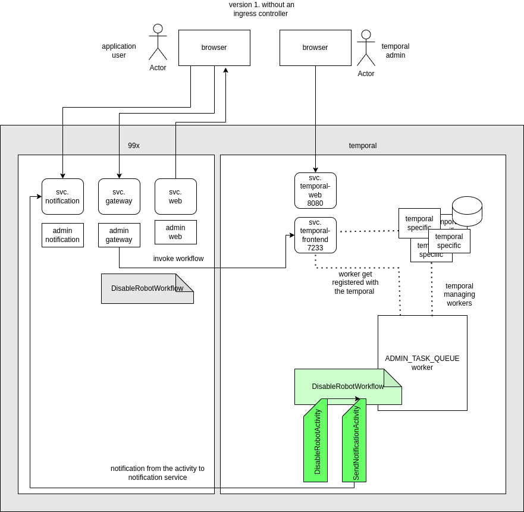

# Temporal kubernetes deployment

!**Work in Progress.**

  

Deploying temporal runtime side by side with native workloads using a local kind cluster as a example

Guide.
1. (install kubetl , optionally tool which can visualize openlens , k9s, headlamp)

2. setup a local cluster using kind (https://kind.sigs.k8s.io/docs/user/quick-start/#installation) 

`kind create cluster --name local-01` (once the installation is successful there), your kube context should have been set to the new cluster

3. building the microservice images
repo contain docker files for each service, each docker file will contain instructions how to build
- docker files
	- microservices/admin_gateway/Dockerfile
	- microservices/admin_notifications/Dockerfile
	- temporal/workers/Dockerfile
	- clients/av1-admin/Dockerfile

4.  load the local images to the kind cluster 
at this point we are not using a container registry, so the local images needs to be present on the cluster to be deployed. for this we are using `kind load docker-image`
(eg loading all the images at once to a local cluster called local-01)
-  `kind load docker-image admin_web admin_gateway admin_worker admin_notifications --name local-01`

3. Deploying services to the cluster. in this step we will deploy temporal and our services to the cluster. (attention on env variables as we do some cross namesapce communication)

	- deployment/kubernetes-local/00_base.yaml
	- deployment/kubernetes-local/01_temporal.txt
	- deployment/kubernetes-local/02_temporal_admin_task_queue_worker.yaml
	- deployment/kubernetes-local/03_admin_gateway.yaml
	- deployment/kubernetes-local/04_admin_notification.yaml
	- deployment/kubernetes-local/05_admin_web.yaml

  ---
  resulting deployment 

  
  
  
---
*housekeeping*
kind delete cluster --name local-01
docker system prune -a
